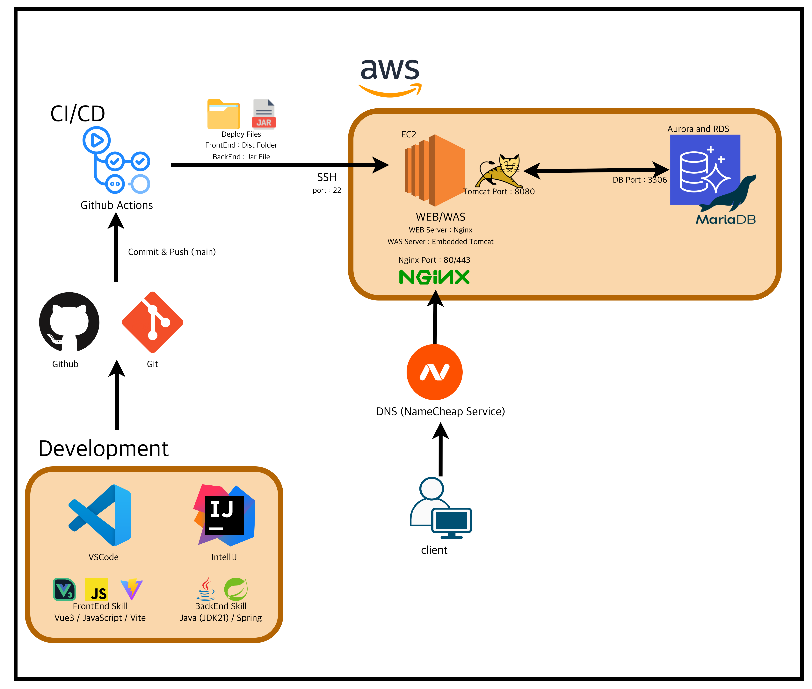

<a id="readme-top"></a>

<!-- BADGES -->

## 🛠 My Tech Stack

## 🖥 Frontend

<p>
  
  
  
  
</p>

---

## ⚙️ Backend

<p>
  
  
    
  
</p>

---

## 🗄 Database

<p>
  
  
  
  
</p>

---

## ☁️ Infrastructure

<p>
  
  
  
</p>

---

## 🔧 DevOps & Version Control

<p>
  
  
  
  
</p>

<br />

<!-- PROJECT LOGO -->
<div align="center">

<a href="https://qwerty-azit.com/">

</a>

<h1 align="center">합주실 예약 관리 시스템</h1>

<h3 align="center">Qwerty-Azit</h3>

<p align="center">
합주실 예약, 회원 관리, 일정 관리를 위한 Full-Stack Web Application
<br><br>
<a href="https://qwerty-azit.com/">
<strong>Live Demo »</strong>
</a>
<br>
<sub>DB 구동 시간 : 매일 09:00 ~ 18:00</sub>

</p>

</div>

---

# 📌 About The Project

본 프로젝트는 실제 합주실 운영 경험을 기반으로 개발한 합주실 예약 관리 시스템입니다.

기존에는 Google Spreadsheet를 사용하여 예약을 관리하였으나 다음과 같은 문제점이 존재했습니다.

- 신규 사용자 권한을 수동으로 부여해야 하는 비효율적인 관리 방식
- 예약 현황 실시간 확인 어려움
- 합주실 정보 및 예약 관리의 체계 부족

이러한 문제를 해결하기 위해 웹 기반 예약 시스템을 설계하고 구축하였습니다.

---

# 🚀 Project Information

| 항목          | 내용                    |
| ------------- | ----------------------- |
| 프로젝트명    | 합주실 예약 관리 시스템 |
| 개발 기간     | 2025.06.01 ~ 2025.08.30 |
| 개발 인원     | 1명 (Full-Stack 개발)   |
| 프로젝트 링크 | https://qwerty-azit.com |

---

# 🛠 Tech Stack

## FrontEnd

- Vue.js (Vue3, Ionic Framework)
- Vite
- JavaScript
- Axios

## BackEnd

- Java
- Spring Boot
- REST API

## Database

- MariaDB (AWS RDS)

## Infrastructure

- AWS EC2
- AWS RDS
- Nginx
- Linux

## DevOps

- Git
- GitHub
- GitHub Actions
- CI/CD 자동 배포

## Tools

- VSCode
- IntelliJ
- DBeaver
- AWS Console
- GitFork

---

# 🏗 System Architecture

<a href="https://qwerty-azit.com/">

</a>

---

# ✨ 주요 기능

## 1. 회원 관리

- 회원가입
- 로그인
- ID 찾기
- Password 찾기
- 회원 관리

---

## 2. 합주실 관리

- 합주실 등록
- 합주실 수정
- 합주실 삭제
- 합주실 정보 조회

---

## 3. 예약 관리

- 예약 생성
- 예약 수정
- 예약 삭제
- 예약 일정 조회

---

## 4. 서버 및 인프라

- AWS EC2 서버 구축
- MariaDB RDS 연동
- 도메인 연결
- Nginx Reverse Proxy 구성

---

# ⚙️ CI/CD Architecture

GitHub Actions를 사용하여 자동 배포 환경을 구축하였습니다.

## ⚙️ CI/CD Flow

```bash
┌──────────────────────────────┐
│   GitHub (main branch) Push  │
└──────────────┬───────────────┘
               │
               ▼
┌──────────────────────────────┐
│      GitHub Actions 실행      │
└──────────────┬───────────────┘
               │
       ┌───────┴────────┐
       ▼                ▼
┌──────────────┐ ┌──────────────┐
│    FrontEnd  │ │    BackEnd   │
│    Build     │ │    Build     │
└──────┬───────┘ └──────┬───────┘
       │                │
       └───────┬────────┘
               ▼
┌──────────────────────────────┐
│         EC2 SSH 접속          │
└──────────────┬───────────────┘
               ▼
┌──────────────────────────────┐
│        기존 Build 제거         │
└──────────────┬───────────────┘
               ▼
┌──────────────────────────────┐
│        신규 Build 배포         │
└──────────────┬───────────────┘
               ▼
┌──────────────────────────────┐
│       Spring 시작             │
└──────────────────────────────┘

```

---

## 보안 구성

민감 정보 보호를 위해 다음과 같이 구성하였습니다.

- DB 정보 → EC2 backend.service 파일 내부 저장
- GitHub Secrets → SSH 접속 정보 관리
- 환경 변수 기반 관리

---

# 👨‍💻 Role & Contribution

본 프로젝트의 전체 설계 및 개발을 단독으로 수행하였습니다.

## 담당 영역

- FrontEnd 개발
- BackEnd 개발
- DB 설계
- AWS 인프라 구축
- CI/CD 구축
- 네트워크 구성

---

## 구현 기능

- 회원 인증 시스템
- 예약 관리 시스템
- 합주실 관리 시스템
- 서버 및 DB 구축
- 자동 배포 환경 구축

---

# 📝 Review

---

## 1. DB

### DB 서버, 어디에 세팅해야 할까? RDS VS EC2

아키텍처 초기 DB 구축 시 EC2 에 DB를 구축하여 RDS를 사용할 때보다 비용 절감을 할 수 있었다. 다만 EC2 에 DB 세팅 시 WEB/WAS 서버 담당 EC2 와 연결, 백업 프로세스 구현 등을 하나부터 열까지 사용자가 직접 세팅해야 하는 어려움이 있었다. <br/> 그 뒤에 RDS 로 세팅할 때 느낀 것은 사용자가 필요로 하는 대부분의 기능 (백업, 확장성, 보안 책임) 등을 레퍼런스를 찾아 손쉽게 구현할 수 있다. 다만 비용 측면에서는 EC2 세팅이 더 저렴했다. DB 커스텀을 원한다면 EC2 세팅을, 커스텀 제약은 있지만 손쉽게 DB 구축 및 관리를 원한다면 RDS를 선택하면 될 듯하다.

---
