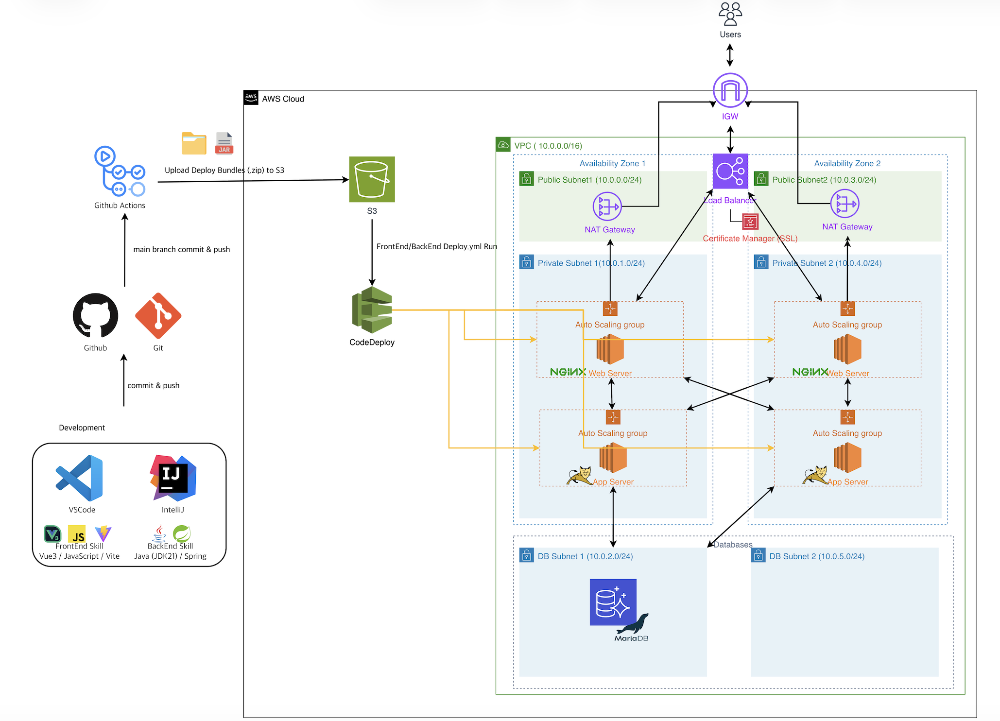
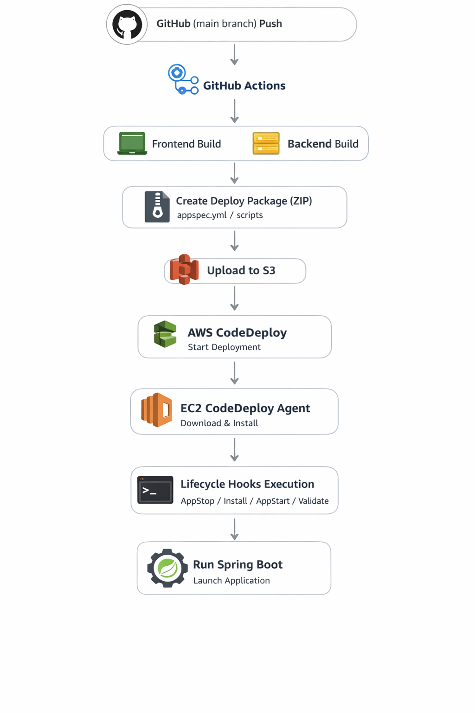

# 👨‍💻 김용현 포트폴리오

### 🚀 Full-Stack Developer | AWS Cloud Engineer

 

 

### 📌 Portfolio Overview

안정성과 확장성을 고려한 **클라우드 기반 웹 서비스 설계 및 구축 경험**을 중심으로  
Frontend부터 Backend, Infra, DevOps까지 전 영역을 직접 구현한 프로젝트입니다.

특히 AWS VPC 기반 **3-Tier Architecture**,  
CI/CD 자동화, 무중단 배포 환경 구축을 통해  
**실제 서비스 운영을 고려한 아키텍처 설계 역량**을 담았습니다.

 

---

## 📚 Table of Contents

- 🛠 Tech Stack
- 📌 About The Project
- 🚀 Project Information
- 🏗 System Architecture
- ✨ 주요 기능
- ⚙️ CI/CD Architecture
- 🔐 Security Architecture
- 👨‍💻 Role & Contribution
- 📝 Architecture Review

 

---

<!-- BADGES -->

## 🛠 My Tech Stack

## 🖥 Frontend

  
  
  
  

---

## ⚙️ Backend

  
  
    
  

---

## 🗄 Database

  
  
  
  

---

## ☁️ Infrastructure

  
  
  

  <!-- Compute -->
  
  

  <!-- Networking -->
  
  

  <!-- Storage -->
  

  <!-- CI/CD -->
  

  <!-- Security -->
  

  <!-- Web Server -->
  

---

## 🔧 DevOps & Version Control

  
  
  
  

 

<!-- PROJECT LOGO -->

<h1 align="center">합주실 예약 관리 시스템 With AWS VPC</h1>

<h3 align="center">Qwerty-Azit</h3>

합주실 예약, 회원 관리, 일정 관리를 위한 Full-Stack Web Application
 
AWS VPC 인프라 + 무중단 배포 구축 

<a href="https://youtu.be/9wTBD9IF33M?si=52RPGyP4-Q1tlf5q">
<strong>Live Demo »</strong>
</a>
 
DB 구동 시간 : 매일 09:00 ~ 18:00

 
 

---

# 📌 About The Project

본 프로젝트는 실제 합주실 운영 경험을 기반으로 개발한 합주실 예약 관리 시스템입니다.

기존에는 Google Spreadsheet를 사용하여 예약을 관리하였으나 다음과 같은 문제점이 존재했습니다.

- 신규 사용자 권한을 수동으로 부여해야 하는 비효율적인 관리 방식
- 예약 현황 실시간 확인 어려움
- 합주실 정보 및 예약 관리의 체계 부족

이러한 문제를 해결하기 위해 웹 기반 예약 시스템을 설계하고 구축하였습니다.

---

# 🚀 Project Information

| 항목          | 내용                    |
| ------------- | ----------------------- |
| 프로젝트명    | 합주실 예약 관리 시스템 |
| VPC 개발 기간 | 2026.03.09 ~ 2026.03.12 |
| 개발 인원     | 1명 (Full-Stack 개발)   |
| 프로젝트 링크 | https://qwerty-azit.com |

---

# 🛠 Tech Stack

## 🖥 FrontEnd

Vue3와 Ionic Framework 기반으로 **모바일 최적화 UI/UX**를 설계 및 개발하였습니다.  
사용자 중심의 직관적인 인터페이스와 상태 관리 구조를 통해 안정적인 화면 흐름을 구현했습니다.

### 1. UI/UX 설계

- Ionic Framework 기반 모바일 최적화 UI 구현
- 사용자 관점의 예약/조회 흐름 설계
- 반응형 레이아웃 구성

### 2. 상태 관리 및 데이터 처리

- Pinia를 활용한 전역 상태 관리
- 로그인 상태 및 사용자 정보 관리
- 컴포넌트 간 데이터 흐름 구조 설계

### 3. API 통신 구조

- Axios 기반 API 통신 모듈 설계
- 공통 인터셉터 적용 (인증/에러 처리)
- REST API 구조에 맞춘 프론트 요청 설계

### 4. 주요 구현 기능

- 회원가입 / 로그인 / 인증 처리
- 예약 생성 / 수정 / 삭제 UI
- 실시간 예약 현황 조회 화면

## ⚙️ BackEnd

Spring Boot 기반으로 **비즈니스 로직 중심의 서버 구조를 설계 및 개발**하였으며,  
JWT 인증과 외부 로그인 연동을 통해 사용자 편의성과 보안을 동시에 확보하였습니다.

### 1. 서버 구조 및 설계

- JDK 21 기반 Spring Boot 애플리케이션 개발
- Controller / Service / Repository 계층 구조 설계
- RESTful API 기반 서비스 구현

### 2. 인증 및 보안

- JWT 토큰 기반 인증/인가 처리
- 로그인 상태 유지 및 토큰 검증 로직 구현
- 카카오 소셜 로그인 연동
- 자동 회원가입 기능 구현 (UX 개선)

### 3. 비즈니스 로직

- 합주실 예약 로직 설계
- 예약 중복 방지 처리
- 사용자 권한 기반 기능 분리

### 4. API 설계

- REST API 표준 설계
- 요청/응답 DTO 구조화
- 예외 처리 및 에러 응답 표준화

### 5. 서버 운영 환경

- Apache Tomcat 기반 WAS 구성
- Nginx Reverse Proxy 연동
- HTTPS (ACM) 기반 보안 통신 적용

## 🗄 Database

합주실 예약 및 회원 관리 데이터를 안정적으로 저장하고 운영하기 위해  
AWS RDS 기반의 관계형 데이터베이스를 구축하였습니다.

- AWS RDS (MariaDB) 기반 DB 서버 구축
- 예약 / 회원 / 일정 관리 테이블 설계
- 제약조건(Primary Key, Foreign Key) 및 데이터 무결성 관리
- VPC 내부 DB Subnet 배치로 외부 접근 차단

---

## ☁️ Infrastructure

AWS VPC 기반 3-Tier Architecture를 설계하여  
보안성과 확장성을 고려한 인프라 환경을 구축하였습니다.

### 1. 네트워크 구성

- AWS VPC 기반 네트워크 설계
- Public / Private Subnet 분리
- Internet Gateway 및 NAT Gateway 구성

### 2. 서버 구성

- Web Server (Nginx) / App Server (Spring Boot) 분리 운영
- AWS EC2 기반 서버 구성 (Amazon Linux)
- Auto Scaling Group 기반 서버 확장 구조 설계

### 3. 트래픽 및 보안

- Application Load Balancer(ALB) 기반 트래픽 분산
- Security Group을 통한 계층별 접근 제어
- AWS Certificate Manager(ACM)를 통한 HTTPS 적용

### 4. 스토리지 및 배포 연계

- AWS S3 기반 정적 파일 및 배포 아티팩트 관리
- AWS CodeDeploy 연계를 통한 배포 자동화

---

## ⚙️ DevOps

CI/CD 자동화 파이프라인을 구축하여  
배포 효율성과 서비스 안정성을 확보하였습니다.

### 1. CI/CD 파이프라인 구성

- GitHub Actions 기반 Build 및 배포 패키지 생성
- AWS S3를 통한 배포 아티팩트 저장
- AWS CodeDeploy를 통한 EC2 배포 실행

### 2. 배포 전략

- 무중단 배포 환경 구성
- Auto Scaling 환경에서 동일 배포 적용
- 배포 실패 시 롤백 가능 구조 설계

### 3. 보안 및 운영

- SSH 접속 없이 배포 수행 (보안 강화)
- GitHub Secrets 기반 민감 정보 관리
- EC2 환경 변수 기반 설정 분리

---

## 🛠 Tools

개발 및 운영 효율성을 높이기 위해 다음과 같은 도구를 활용하였습니다.

- VSCode : FrontEnd 개발
- IntelliJ : BackEnd 개발
- DBeaver : DB 관리 및 쿼리 수행
- AWS Console : 인프라 구성 및 운영
- GitFork : Git 형상 관리

---

# 🏗 System Architecture

---

# ✨ 주요 기능

## 1. 회원 관리

- 회원가입
- 로그인
- ID 찾기
- Password 찾기
- 회원 관리

---

## 2. 합주실 관리

- 합주실 등록
- 합주실 수정
- 합주실 삭제
- 합주실 정보 조회

---

## 3. 예약 관리

- 예약 생성
- 예약 수정
- 예약 삭제
- 예약 일정 조회

---

## 4. 서버 및 인프라

본 프로젝트는 AWS VPC 기반의 3-Tier Architecture로 구축되었습니다.

구성 요소는 다음과 같습니다.

- AWS VPC 기반 네트워크 설계
- Public / Private Subnet 분리
- Application Load Balancer (ALB) 구성
- Web / App 서버 EC2 분리 운영
- AWS RDS (MariaDB) 연동
- Auto Scaling 기반 서버 확장 구조
- AWS Certificate Manager 기반 HTTPS 적용

---

# ⚙️ CI/CD Architecture

본 프로젝트는 GitHub Actions + AWS CodeDeploy 기반 자동 배포 환경을 구축하였습니다.

기존처럼 GitHub Actions가 EC2 서버에 직접 SSH로 접속하여 배포하는 방식이 아니라,
S3와 CodeDeploy를 활용하여 EC2 내부에서 배포가 실행되는 구조로 설계하였습니다.

이를 통해 다음과 같은 장점을 확보했습니다.

- 무중단 배포 환경 구성
- SSH 접근 없이 배포 가능
- 배포 표준화
- Auto Scaling 환경에서 동일한 배포 적용
- 배포 실패 시 롤백 가능

## ⚙️ CI/CD 구성 요소

| 구성 요소                        | 역할                                              |
| -------------------------------- | ------------------------------------------------- |
| **GitHub Actions**               | Frontend / Backend Build 수행 및 배포 패키지 생성 |
| **AWS S3**                       | 빌드 산출물(배포 아티팩트) 저장                   |
| **AWS CodeDeploy**               | 배포 관리 및 EC2 배포 실행                        |
| **EC2 CodeDeploy Agent**         | EC2 내부에서 배포 패키지 다운로드 및 배포 실행    |
| **appspec.yml + Deploy Scripts** | 서버 내부 배포 로직 정의 및 Lifecycle Hook 실행   |

## ⚙️ CI/CD Flow

---

## 🔐 Security Architecture

본 프로젝트는 AWS VPC 기반 인프라를 구성하여 서버와 데이터베이스의 직접적인 외부 노출을 차단하고, 계층별 접근 제어를 통해 보안을 강화하였습니다.

### VPC 네트워크 보안

- Web / App 서버를 **Private Subnet**에 배치하여 외부에서 직접 접근할 수 없도록 구성
- 외부 트래픽은 **Application Load Balancer(ALB)** 를 통해서만 접근 가능
- 데이터베이스는 **DB Subnet(RDS)** 에 배치하여 외부 접근 차단

### Security Group 기반 접근 제어

각 계층별 서버 간 접근을 다음과 같이 제한하였습니다.

| Source     | Destination | Port     | Description          |
| ---------- | ----------- | -------- | -------------------- |
| Internet   | ALB         | 80 / 443 | 외부 사용자 접근     |
| ALB        | Web Server  | 80       | Web 서버 트래픽 전달 |
| Web Server | App Server  | 8080     | 내부 API 요청        |
| App Server | RDS         | 3306     | DB 접근              |

이를 통해 **외부 → 내부 서버 직접 접근을 차단**하고 계층별 통신만 허용하였습니다.

### CI/CD 보안

배포 과정에서 서버 직접 접근을 최소화하기 위해 다음 구조를 사용했습니다.

- GitHub Actions → Build
- AWS S3 → 배포 아티팩트 저장
- AWS CodeDeploy → EC2 배포 실행

이 구조를 통해

- SSH Key 기반 직접 접속 제거
- 배포 표준화
- 서버 접근 최소화

를 구현했습니다.

### 민감 정보 관리

민감 정보는 코드 저장소에 포함하지 않고 다음 방식으로 관리합니다.

- **GitHub Secrets**
  - AWS Access Key
  - AWS Secret Key

- **EC2 환경 변수**
  - DB 접속 정보
  - 서버 환경 설정

이를 통해 민감 정보를 코드와 분리하여 관리합니다.

---

# 👨‍💻 Role & Contribution

본 프로젝트의 전체 설계 및 개발을 단독으로 수행하였습니다.

## 담당 영역

- FrontEnd 개발
- BackEnd 개발
- DB 설계
- AWS 인프라 구축
- CI/CD 구축
- 네트워크 구성

---

## 구현 기능

- 회원 인증 시스템
- 예약 관리 시스템
- 합주실 관리 시스템
- 서버 및 DB 구축
- 자동 배포 환경 구축

---

# 📝 Review

---

## 🗄 Database

### DB 서버 구축 방식 : RDS vs EC2

프로젝트 초기 아키텍처 설계 단계에서는 데이터베이스를 **EC2에 직접 구축하는 방식**과  
**AWS RDS를 사용하는 방식**을 비교하여 검토하였습니다.

---

### 1. EC2 기반 DB 구축

초기에는 비용 절감을 위해 EC2 인스턴스에 MariaDB를 직접 설치하여 운영하는 방식을 고려했습니다.

EC2에 DB를 구축할 경우 다음과 같은 장점이 있습니다.

- 인프라 비용 절감
- DB 설정 및 커스터마이징 자유도 높음
- 특정 환경에 맞는 DB 튜닝 가능

하지만 실제 구축 과정에서는 다음과 같은 단점이 존재했습니다.

- 백업 및 복구 시스템 직접 구축 필요
- 장애 대응 및 복제 구성 직접 관리 필요
- DB 보안 설정 및 네트워크 관리 부담 증가
- WEB / WAS 서버와의 연결 및 방화벽 설정 직접 관리 필요

즉 **DB 운영 및 관리에 대한 부담이 상당히 높다는 단점**이 존재했습니다.

---

### 2. RDS 기반 DB 구축

이러한 문제를 해결하기 위해 **AWS RDS (Relational Database Service)** 를 사용하여 데이터베이스를 구축하였습니다.

RDS를 사용할 경우 다음과 같은 장점이 있습니다.

- 자동 백업 및 스냅샷 지원
- 장애 발생 시 복구 기능 제공
- DB 패치 및 유지보수 자동화
- 보안 그룹 기반 접근 제어
- 스토리지 및 성능 확장 용이

특히 **VPC 내부 DB Subnet에 배치하여 외부 접근을 차단할 수 있다는 점**이 큰 장점이었습니다.

---

### 3. 최종 선택 : RDS

본 프로젝트에서는 다음과 같은 이유로 **RDS 기반 DB 아키텍처**를 선택하였습니다.

- 운영 편의성
- 안정적인 백업 및 복구 기능
- 보안 관리 용이
- VPC 기반 Private DB 구성 가능

현재 데이터베이스는 **VPC 내부 DB Subnet에 위치한 AWS RDS (MariaDB)** 로 구성되어 있으며  
애플리케이션 서버에서만 접근할 수 있도록 설정되어 있습니다.

---

### 4. VPC 아키텍처 도입 배경

초기에는 AWS 기본 네트워크인 **Default VPC** 환경에서 서버를 구축하여 운영하였습니다.

구성은 다음과 같았습니다.

- 단일 EC2 인스턴스에서 Web / App 서버 통합 운영
- RDS를 Default VPC에 구성
- GitHub Actions에서 EC2로 직접 SSH 접속하여 배포

하지만 이 구조는 다음과 같은 문제점을 가지고 있었습니다.

- 모든 서버가 퍼블릭 네트워크에 노출
- 접속 정보 탈취 시 외부에서 직접 접근 가능
- 서버 역할이 통합되어 장애 발생 시 서비스 전체 중단
- 확장성과 보안 측면에서 한계 존재

---

### 5. 3-Tier Architecture 도입

이러한 문제를 해결하기 위해 **AWS VPC 기반 3-Tier Architecture** 를 구축하였습니다.

구성은 다음과 같습니다.

### VPC Architecture

각 계층을 분리함으로써 다음과 같은 장점을 확보할 수 있었습니다.

- 서버 역할 분리
- 보안 강화 (Private Subnet 기반 서버 운영)
- Auto Scaling 기반 확장성 확보
- 장애 발생 시 서비스 안정성 향상

---

### 6. 고가용성(High Availability)과 내결함성(Fault Tolerance)

#### 고가용성 (High Availability)

시스템 내부에 장애가 발생하더라도 **서비스 중단 시간을 최소화하고 지속적으로 서비스를 제공하는 능력**을 의미합니다.

고가용성을 확보하기 위한 방법

- 서버 이중화
- 로드밸런싱
- Auto Scaling
- 다중 AZ 구성

#### 내결함성 (Fault Tolerance)

시스템 일부 구성요소에 장애가 발생하더라도 **전체 서비스가 중단되지 않고 정상적으로 동작하도록 설계하는 능력**을 의미합니다.

내결함성을 확보하기 위한 방법

- 서버 다중화
- 장애 발생 시 자동 복구
- 트래픽 분산 처리

---

### 7. VPC 구축 과정

본 프로젝트에서 VPC를 구축한 주요 과정은 다음과 같습니다.

1. VPC 생성 및 CIDR 설계
2. Public / Private Subnet 생성
3. Internet Gateway 생성 및 VPC 연결
4. Public Routing Table 구성
5. NAT Gateway 생성
6. Private Routing Table 구성
7. Private Subnet에 Web / App Server 배치
8. Auto Scaling 및 Load Balancer 구성

---

### 8. Architecture Review

이번 VPC 구축을 통해 다음과 같은 점을 경험할 수 있었습니다.

- AWS 아키텍처에서 네트워크 설계의 중요성
- 서버 역할 분리를 통한 안정성 확보
- Private Network 기반 보안 강화
- Auto Scaling과 Load Balancer를 통한 확장성 확보

이를 통해 **보안성, 확장성, 안정성을 동시에 확보한 클라우드 아키텍처를 구현할 수 있었습니다.**
